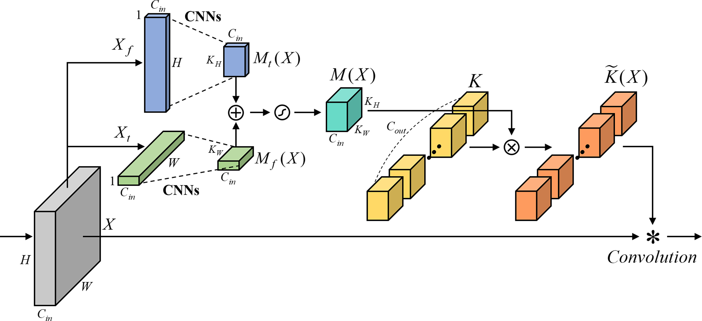

# ACNN for Text-Independent Speaker Recognition

Official implementation of **Adaptive Convolutional Neural Network for Text-Independent Speaker Recognition** 
by Seong-Hu Kim, Yong-Hwa Park @ Human Lab, Mechanical Engineering Department, KAIST

Accepted paper in [InterSpeech 2021](https://www.interspeech2021.org/)

Paper will be available.

## Adaptive Convolutional Neural Network Module
We use two scaling maps, which are frequency and time domain, to each axis for the adaptive kernel in the ACNN module.  The adaptive kernel K˜ (X) is created by element-wise multiplication of each output channel C_{out} of the content-invariant kernel K with M(X). The structure of proposed ACNN module for speaker recognition is shown as follows. 
 

- This module is applied to VGG-M and ResNet for text-independent speaker recognition. 

## Requirements and versions used
- pytorch >= 1.4.0
- pytorchaudio >= 0.4.0
- numpy >= 1.18

